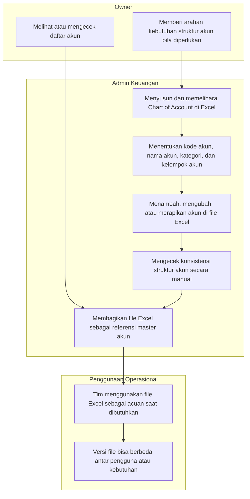

# Epic Context: Chart of Account

## Nama Epic
Chart of Account

## Business Process Diagram

```mermaid
flowchart TD
  subgraph Owner["Owner"]
    O1["Memberi arahan kebutuhan struktur akun bila diperlukan"]
    O2["Melihat atau mengecek daftar akun"]
  end

  subgraph Finance["Admin Keuangan"]
    F1["Menyusun dan memelihara Chart of Account di Excel"]
    F2["Menentukan kode akun, nama akun, kategori, dan kelompok akun"]
    F3["Menambah, mengubah, atau merapikan akun di file Excel"]
    F4["Mengecek konsistensi struktur akun secara manual"]
    F5["Membagikan file Excel sebagai referensi master akun"]
  end

  subgraph Ops["Penggunaan Operasional"]
    U1["Tim menggunakan file Excel sebagai acuan saat dibutuhkan"]
    U2["Versi file bisa berbeda antar pengguna atau kebutuhan"]
  end

  O1 --> F1
  O2 --> F5
  F1 --> F2 --> F3 --> F4 --> F5
  F5 --> U1 --> U2
```
