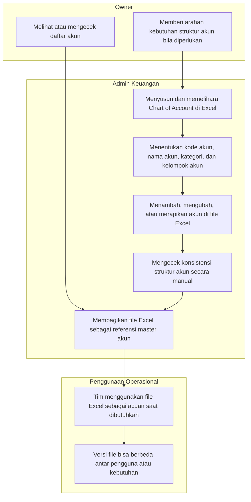

# Epic Context: Chart of Account

## Status
Draft eksplorasi awal level epic.

## Ringkasan Epic
Epic ini berfokus pada pembentukan Chart of Account sebagai master akun awal di aplikasi accounting. Pada tahap sekarang, fokusnya masih pada setup dan pengelolaan master akun, dengan arah ke depan agar struktur akun ini dapat dipakai oleh modul lain seperti transaksi.

## Aktor Terdampak
- Admin Keuangan
- Owner

## Business Process Diagram
Kondisi saat ini masih as-is dan dikelola di Excel.

## Asumsi yang Sudah Disepakati
- Pengelolaan COA saat ini masih dilakukan di Excel.
- Tidak ada approval formal saat akun ditambah atau diubah.
- Struktur akun saat ini belum baku.
- Kadang ada beberapa versi file COA yang beredar.
- Fokus epic saat ini adalah setup master akun terlebih dahulu.
- COA disiapkan agar nantinya dapat dipakai oleh modul lain.

## Catatan Lanjutan
Section berikutnya yang perlu disusun adalah Problem Statement, lalu Tujuan Epic, KPI, Scope, dan artefak lanjutan lain sesuai alur eksplorasi epic.
