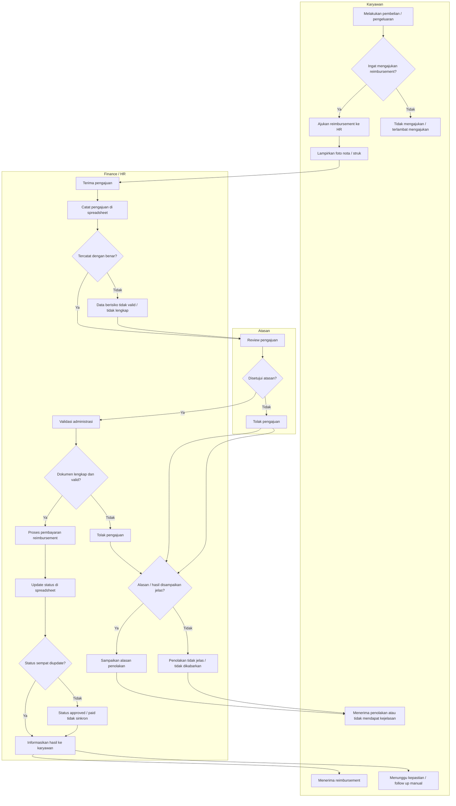

# Epic Context: Reimbursement

## Business Process Diagram

## Problem Statement

## Masalah Utama

Proses reimbursement karyawan saat ini masih berjalan secara semi digital dan belum terintegrasi untuk seluruh jenis reimbursement. Pengajuan, approval oleh atasan, final approval oleh Finance, validasi, dan pembayaran masih bergantung pada koordinasi manual antar pihak. Akibatnya, status reimbursement sulit dipantau secara transparan, data rawan tidak sinkron, keputusan penolakan tidak selalu jelas, dan pengajuan berisiko terlambat diproses atau tidak tertangani secara konsisten end-to-end.

## Indikasi Masalah

| Indikasi masalah | Dampak bisnis/operasional |
|---|---|
| Pengajuan reimbursement masih diajukan secara manual ke HR | Proses bergantung pada follow up manual dan rawan terlambat ditangani |
| Pencatatan pengajuan masih menggunakan spreadsheet | Data reimbursement rawan tidak akurat, tidak konsisten, atau tidak ter-update |
| Status approved dan paid tidak selalu diperbarui secara konsisten | HR/Finance kesulitan mengetahui mana yang sudah dibayar dan mana yang belum |
| Penolakan pengajuan tidak selalu disertai alasan yang jelas | Karyawan tidak mendapat transparansi atas keputusan reimbursement |
| Karyawan kadang lupa mengajukan reimbursement | Pengajuan bisa terlambat atau tidak masuk ke proses sama sekali |
| Komunikasi hasil pengajuan masih tidak konsisten | Karyawan harus follow up manual untuk mengetahui status reimbursement |

## Konteks yang Sudah Dikonfirmasi

- Approval layer 1 dilakukan oleh atasan.
- Final approval dilakukan oleh Finance.
- Cakupan berlaku untuk seluruh reimbursement.

## Tujuan

### Tujuan Utama

Mewujudkan proses reimbursement yang lebih terkontrol, transparan, dan mudah dipantau end-to-end oleh karyawan, atasan, dan HR/Finance.

### Hasil yang Ingin Dicapai

#### Proses Lebih Terkontrol

- Alur pengajuan, approval, validasi, dan pembayaran berjalan lebih tertib.
- Risiko data approved dan paid tidak sinkron dapat dikurangi.
- Beban follow up manual dari karyawan maupun HR/Finance dapat dikurangi.

#### Proses Lebih Transparan

- Status pengajuan dapat diketahui dengan jelas oleh pihak terkait.
- Keputusan approve atau reject lebih jelas, termasuk alasan penolakan.

## Indikator Keberhasilan

| Kategori | Target | Deskripsi | Cara Pengukuran | Waktu Pengukuran | Penanggung Jawab |
|---|---|---|---|---|---|
| Kontrol Proses | >= 90% pengajuan reimbursement yang sudah approved memiliki status pembayaran yang jelas | Mengukur apakah proses reimbursement sudah lebih terkendali dari approval sampai pembayaran. | Bandingkan jumlah pengajuan approved yang memiliki status pembayaran jelas dengan total pengajuan approved. | 1-3 bulan awal setelah implementasi | PO / HR / Finance |
| Transparansi | >= 90% pengajuan reimbursement memiliki status dan hasil yang jelas bagi pihak terkait | Mengukur apakah karyawan dan tim internal dapat mengetahui posisi akhir atau progres pengajuan dengan lebih transparan. | Review total pengajuan dan cek apakah status serta hasil pengajuannya tercatat dengan jelas. | 1-3 bulan awal setelah implementasi | PO / HR / Finance |
| Kemudahan Pemantauan | >= 80% penurunan kebutuhan follow up manual terkait status reimbursement | Mengukur apakah proses reimbursement lebih mudah dipantau tanpa banyak pengecekan manual ke HR/Finance. | Bandingkan jumlah follow up manual terkait status reimbursement sebelum dan sesudah implementasi. | 1-3 bulan awal setelah implementasi | PO / HR / Finance |
