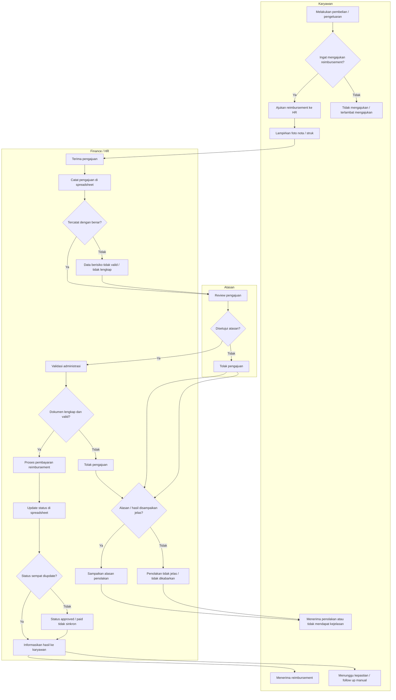
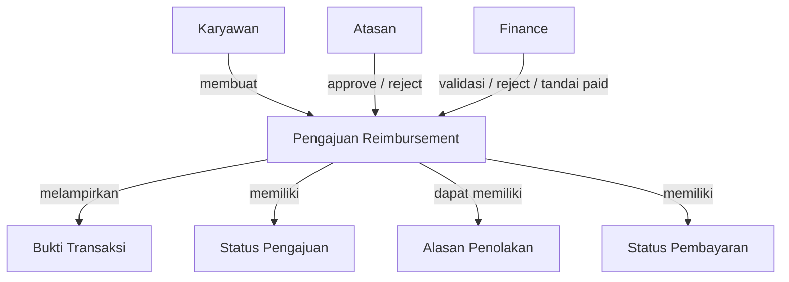
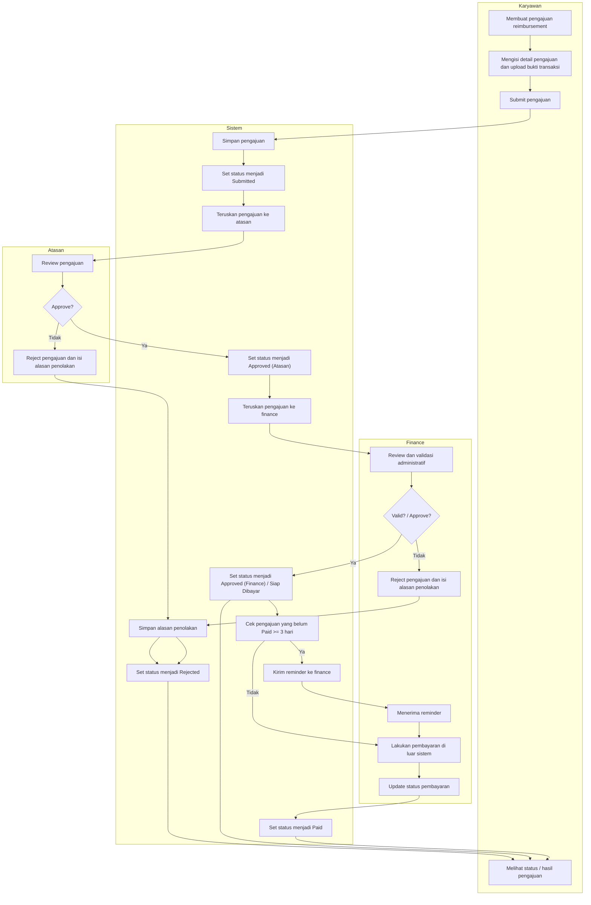

# Epic Context: Reimbursement

## Business Process Diagram

## Problem Statement

## Masalah Utama

Proses reimbursement karyawan saat ini masih berjalan secara semi digital dan belum terintegrasi untuk seluruh jenis reimbursement. Pengajuan, approval oleh atasan, final approval oleh Finance, validasi, dan pembayaran masih bergantung pada koordinasi manual antar pihak. Akibatnya, status reimbursement sulit dipantau secara transparan, data rawan tidak sinkron, keputusan penolakan tidak selalu jelas, dan pengajuan berisiko terlambat diproses atau tidak tertangani secara konsisten end-to-end.

## Indikasi Masalah

| Indikasi masalah | Dampak bisnis/operasional |
|---|---|
| Pengajuan reimbursement masih diajukan secara manual ke HR | Proses bergantung pada follow up manual dan rawan terlambat ditangani |
| Pencatatan pengajuan masih menggunakan spreadsheet | Data reimbursement rawan tidak akurat, tidak konsisten, atau tidak ter-update |
| Status approved dan paid tidak selalu diperbarui secara konsisten | HR/Finance kesulitan mengetahui mana yang sudah dibayar dan mana yang belum |
| Penolakan pengajuan tidak selalu disertai alasan yang jelas | Karyawan tidak mendapat transparansi atas keputusan reimbursement |
| Karyawan kadang lupa mengajukan reimbursement | Pengajuan bisa terlambat atau tidak masuk ke proses sama sekali |
| Komunikasi hasil pengajuan masih tidak konsisten | Karyawan harus follow up manual untuk mengetahui status reimbursement |

## Konteks yang Sudah Dikonfirmasi

- Approval layer 1 dilakukan oleh atasan.
- Final approval dilakukan oleh Finance.
- Cakupan berlaku untuk seluruh reimbursement.

## Tujuan

### Tujuan Utama

Mewujudkan proses reimbursement yang lebih terkontrol, transparan, dan mudah dipantau end-to-end oleh karyawan, atasan, dan HR/Finance.

### Hasil yang Ingin Dicapai

#### Proses Lebih Terkontrol

- Alur pengajuan, approval, validasi, dan pembayaran berjalan lebih tertib.
- Risiko data approved dan paid tidak sinkron dapat dikurangi.
- Beban follow up manual dari karyawan maupun HR/Finance dapat dikurangi.

#### Proses Lebih Transparan

- Status pengajuan dapat diketahui dengan jelas oleh pihak terkait.
- Keputusan approve atau reject lebih jelas, termasuk alasan penolakan.

## Indikator Keberhasilan

| Kategori | Target | Deskripsi | Cara Pengukuran | Waktu Pengukuran | Penanggung Jawab |
|---|---|---|---|---|---|
| Kontrol Proses | >= 90% pengajuan reimbursement yang sudah approved memiliki status pembayaran yang jelas | Mengukur apakah proses reimbursement sudah lebih terkendali dari approval sampai pembayaran. | Bandingkan jumlah pengajuan approved yang memiliki status pembayaran jelas dengan total pengajuan approved. | 1-3 bulan awal setelah implementasi | PO / HR / Finance |
| Transparansi | >= 90% pengajuan reimbursement memiliki status dan hasil yang jelas bagi pihak terkait | Mengukur apakah karyawan dan tim internal dapat mengetahui posisi akhir atau progres pengajuan dengan lebih transparan. | Review total pengajuan dan cek apakah status serta hasil pengajuannya tercatat dengan jelas. | 1-3 bulan awal setelah implementasi | PO / HR / Finance |
| Kemudahan Pemantauan | >= 80% penurunan kebutuhan follow up manual terkait status reimbursement | Mengukur apakah proses reimbursement lebih mudah dipantau tanpa banyak pengecekan manual ke HR/Finance. | Bandingkan jumlah follow up manual terkait status reimbursement sebelum dan sesudah implementasi. | 1-3 bulan awal setelah implementasi | PO / HR / Finance |

## Scope

### In Scope

- Pengajuan reimbursement secara digital oleh karyawan.
- Upload dan penyimpanan bukti transaksi (nota/struk).
- Workflow reimbursement end-to-end hingga status siap dibayar, mencakup approval dan validasi secara high-level.
- Tracking status pengajuan secara granular yang menunjukkan posisi pengajuan dalam proses.
- Update dan pencatatan status pembayaran (`paid` / belum dibayar) oleh HR/Finance.
- Reminder untuk pengajuan yang sudah approved tetapi belum dibayar dalam periode tertentu.

### Planned Features

| Fitur | Deskripsi | Kapan Akan Dikerjakan |
|---|---|---|
| Notifikasi Reimbursement | Mengirim notifikasi otomatis pada setiap perubahan status (`submit`, `approve`, `reject`, `paid`). Trade-off saat ini: user masih bisa melihat status secara langsung di sistem tanpa notifikasi. Alasan ditunda: fokus awal pada kejelasan flow dan status terlebih dahulu sebelum optimasi komunikasi. | Belum ditentukan |
| Timeline / Riwayat Status | Menampilkan histori lengkap perjalanan pengajuan (siapa melakukan apa dan kapan). Trade-off saat ini: hanya status terkini yang ditampilkan. Alasan ditunda: implementasi membutuhkan struktur data tambahan dan belum menjadi kebutuhan paling kritikal di fase awal. | Belum ditentukan |
| Multi-level Approval | Mendukung lebih dari satu level persetujuan (misalnya atasan langsung dan level di atasnya). Trade-off saat ini: diasumsikan satu level approval sudah mencukupi. Alasan ditunda: menambah kompleksitas dan belum tentu relevan untuk semua bisnis. | Dipertimbangkan saat Epik Approval |
| Resubmit / Revisi Pengajuan | Memungkinkan karyawan memperbaiki pengajuan yang ditolak tanpa membuat pengajuan baru. Trade-off saat ini: user harus membuat ulang pengajuan. Alasan ditunda: menjaga flow tetap sederhana di fase awal. | Belum ditentukan |
| Integrasi Pembayaran | Integrasi dengan sistem bank atau payment untuk otomatisasi pembayaran. Trade-off saat ini: pembayaran dilakukan di luar sistem dan hanya update status. Alasan ditunda: kompleksitas tinggi dan dependency eksternal. | Belum ditentukan |

### Out of Scope

| Out Of Scope | Catatan |
|---|---|
| Proses pembayaran aktual (transfer dana) | Dilakukan di luar sistem, sistem hanya mencatat status |
| Pencatatan akuntansi / jurnal keuangan | Akan ditangani di modul Accounting |
| Reminder Pengajuan Belum Dibuat | Mengingatkan karyawan untuk mengajukan reimbursement setelah melakukan pengeluaran. Alasan: membutuhkan mekanisme tambahan di luar scope saat ini. |

## Aturan Bisnis

### 1. Aturan Pengajuan

- Karyawan dapat membuat pengajuan reimbursement dengan:
  - mengisi informasi dasar (tanggal, nominal, deskripsi, dll)
  - melampirkan bukti transaksi (nota/struk)
- Pengajuan langsung berstatus `Submitted`.
- Tidak terdapat status draft.
- Setiap pengajuan adalah satu siklus (tidak dapat diubah setelah diproses).

### 2. Aturan Approval (Atasan)

- Pengajuan dengan status `Submitted` akan diteruskan ke atasan.
- Atasan dapat:
  - `Approve` tanpa wajib memvalidasi dokumen secara detail
  - `Reject`
- Jika atasan `Reject`:
  - wajib memberikan alasan penolakan
  - status menjadi `Rejected`
  - proses selesai

### 3. Aturan Validasi (Finance / HR)

- Pengajuan yang telah di-approve atasan akan otomatis masuk ke Finance/HR.
- Finance/HR melakukan validasi administratif.
- Finance/HR dapat:
  - `Approve` (menjadi siap dibayar)
  - `Reject`
- Jika Finance/HR `Reject`:
  - wajib memberikan alasan penolakan
  - status menjadi `Rejected`
  - keputusan bersifat final
  - karyawan harus membuat pengajuan baru jika ingin mengajukan kembali

### 4. Aturan Status dan Transisi

Status:

- `Submitted`
- `Approved (Atasan)`
- `Approved (Finance) / Siap Dibayar`
- `Rejected`
- `Paid`

Transisi:

- `Submitted` -> `Approved (Atasan)`
- `Submitted` -> `Rejected (Atasan)`
- `Approved (Atasan)` -> `Approved (Finance)`
- `Approved (Atasan)` -> `Rejected (Finance)`
- `Approved (Finance)` -> `Paid`

Ketentuan:

- Setiap pengajuan harus selalu memiliki status yang jelas.
- Status mencerminkan posisi terakhir dalam proses.
- Status tidak dapat kembali ke tahap sebelumnya.
- Status `Rejected` adalah terminal (`end state`).

### 5. Aturan Pembayaran

- Pengajuan dengan status `Approved (Finance)` dianggap siap dibayar.
- Proses pembayaran dilakukan di luar sistem.
- HR/Finance wajib mengupdate status menjadi `Paid` setelah pembayaran dilakukan.

### 6. Aturan Reminder

- Sistem akan memberikan reminder untuk pengajuan yang:
  - sudah `Approved (Finance)`
  - tetapi belum berstatus `Paid` dalam waktu >= 3 hari
- Reminder dikirim kepada HR/Finance.

## Diagram Konsep

## Daftar Fitur

| Fitur | Goal Fitur | Problem Statement Fitur | Prioritas |
|---|---|---|---|
| Daftar Reimbursement | Menyediakan daftar pengajuan reimbursement sesuai kebutuhan masing-masing role | Proses follow up dan pemantauan pengajuan masih manual dan tidak terpusat | Tinggi |
| Pengajuan Reimbursement | Memungkinkan karyawan membuat dan submit pengajuan reimbursement secara digital | Pengajuan masih manual/semi digital dan rawan terlambat diproses | Tinggi |
| Detail Reimbursement | Menampilkan detail pengajuan, bukti transaksi, status, dan hasil keputusan | Informasi pengajuan tidak transparan dan sulit dipantau end-to-end | Tinggi |
| Persetujuan Atasan | Memungkinkan atasan memberi keputusan approve atau reject pada pengajuan | Approval awal masih bergantung pada koordinasi manual | Tinggi |
| Persetujuan Finance | Memungkinkan finance melakukan validasi administratif dan memberi keputusan final | Validasi dan keputusan akhir belum tercatat konsisten | Tinggi |
| Update Status Pembayaran | Memungkinkan finance mencatat bahwa reimbursement sudah dibayar | Status approved dan paid rawan tidak sinkron | Tinggi |
| Reminder Pembayaran | Mengingatkan finance atas pengajuan yang siap dibayar tetapi belum dibayar | Pengajuan approved bisa tertahan tanpa tindak lanjut yang jelas | Sedang |

## Peta Flow Awal

## Role Matrix

| Nama Fitur | Karyawan | Atasan | Finance |
|---|---|---|---|
| Daftar Reimbursement | true | true | true |
| Pengajuan Reimbursement | true | false | false |
| Detail Reimbursement | true | true | true |
| Persetujuan Atasan | false | true | false |
| Persetujuan Finance | false | false | true |
| Update Status Pembayaran | false | false | true |
| Reminder Pembayaran | false | false | true |
